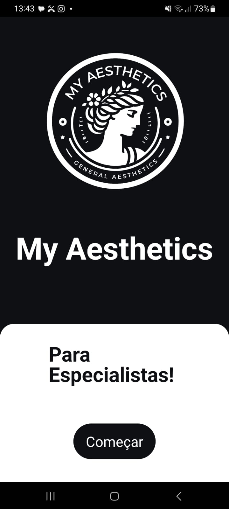
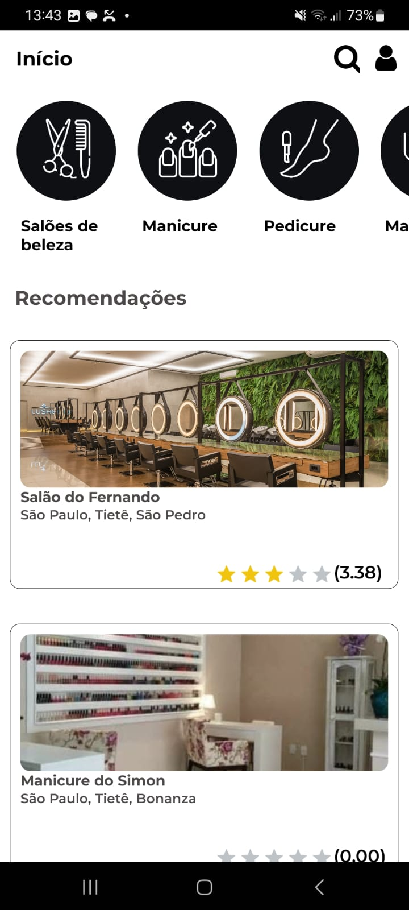
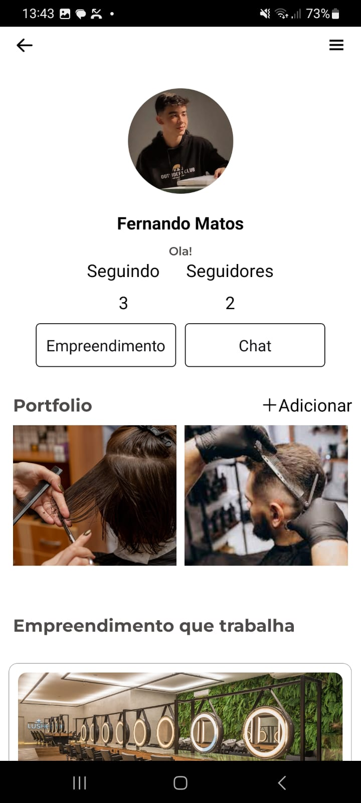

# MyAesthetics
> Status: Em desenvolvimento

## 📕 Sobre
MyAesthetic é um aplicativo que tem como objetivo ajudar a conectar os microempreendedores da estética ao seus cliente, 
onde os mesmos buscam por efetividade e versatilidade em seu dia a dia. 

## 📷 Fotos

<div flex>
  
  
  
  
  
</div>

## 🔨 Ferramentas

- [Node](https://nodejs.org/docs/latest/api/)
- [React](https://legacy.reactjs.org/docs/getting-started.html)
- [React Native](https://reactnative.dev/docs/getting-started)
- [Back4app](https://www.back4app.com/)

## ⚙️ Instalação

- Cuidado, pode conter erros no código!

```bash
  #Clone the project
  $ git clone https://github.com/F3rnando897/MyAesthetics.git
```

```bash
  #Enter in directory
  $ cd MyAesthetics
```

```bash
  #Install all depedencies, if use npm
  $ npm install
```
<p align="center">ou</p>

```bash
  #Install all depedencies, if use yarn
  $ yarn
```

## 📜 Licença
This project is under the Fernando Matos license.
